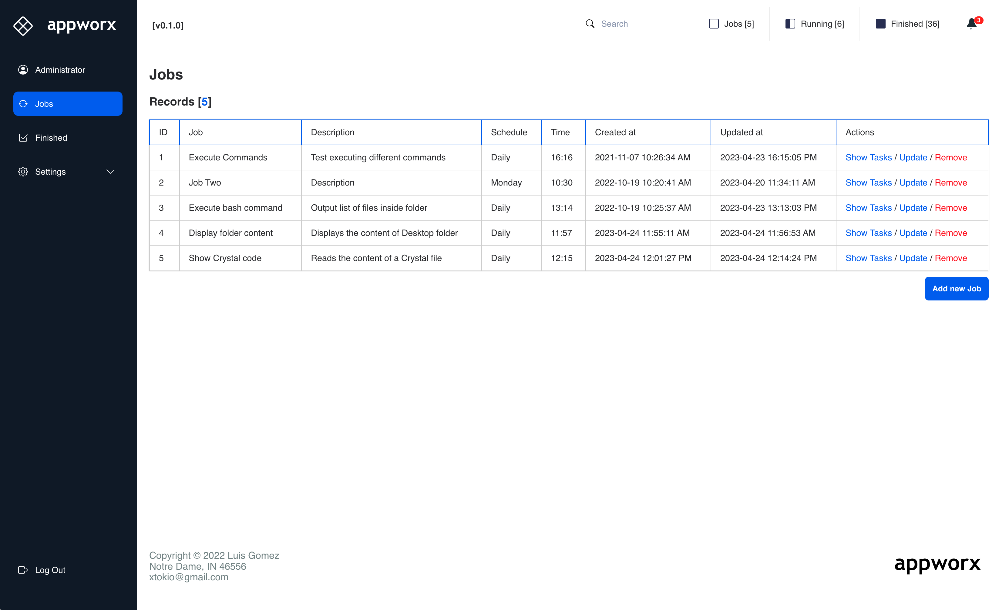
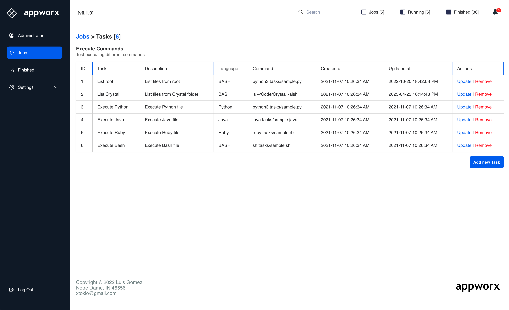
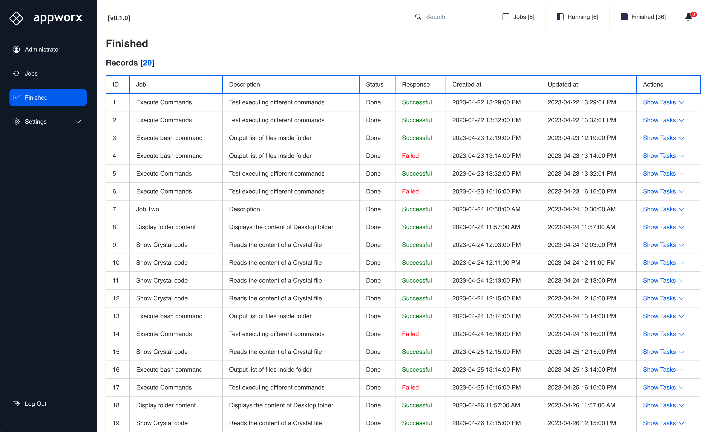
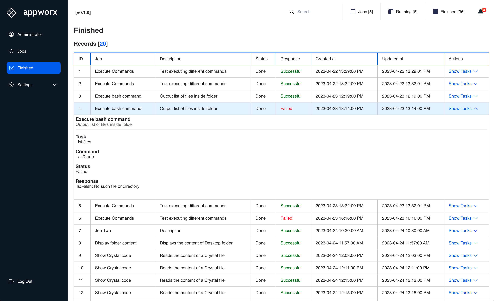
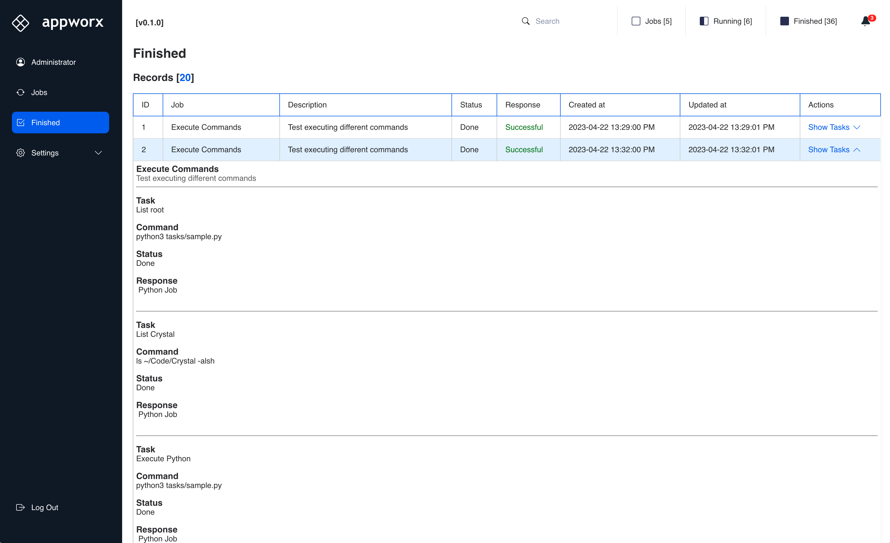
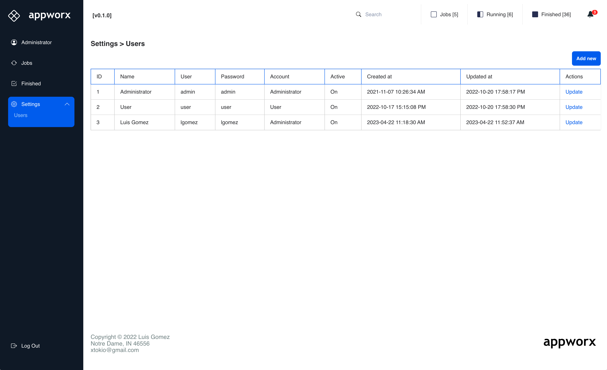

# Appworx

Scheduling tool made in Crystal Lang to run console commands.
#### Work In Progress:
1. Dashboard interface - Done.
2. Schedule jobs in the background

#### Screenshots

Login page
<br>
User: `admin`
<br>
Pass: `admin`
<br><br>


Dashboard > Jobs


Dashboard > Tasks


Dashboard > Finished


Dashboard > Finished > Details



Settings > Users



## Installation

```shards install```

```crystal build src/appworx.cr --release```

```./appworx```


## Usage

### SQLite3
There are a couple of examples in the SQLite database to execute `Bash`, `Ruby`, `Python` and `Java` ( need to have those code languages installed in your system )

## Contributing

1. Fork it (<https://github.com/xtokio/appworx/fork>)
2. Create your feature branch (`git checkout -b my-new-feature`)
3. Commit your changes (`git commit -am 'Add some feature'`)
4. Push to the branch (`git push origin my-new-feature`)
5. Create a new Pull Request

## Contributors

- [Luis Gomez](https://github.com/xtokio) - creator and maintainer
